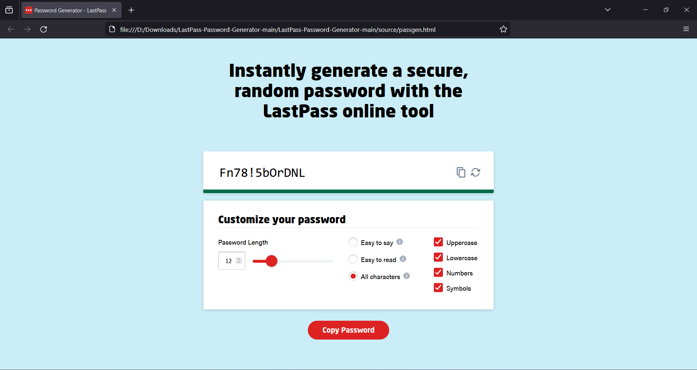

# LastPass Password Generator
 Source code of LastPass Password Generator Tool



## Disclaimer

**Please note that this repository is not an original creation and is not affiliated with LastPass. The "LastPass Password Generator" is a rip-off of the original tool available on the LastPass website. The purpose of this repository is to provide a locally hosted version of the LastPass password generator while ensuring privacy by removing all trackers.**

## Introduction

The LastPass Password Generator is a convenient tool that allows you to generate strong and secure passwords for your online accounts. This repository provides a locally hosted version of the LastPass password generator, allowing you to generate passwords without relying on an internet connection.

## Features

- Generate strong passwords: The LastPass Password Generator utilizes a robust algorithm to generate unique and secure passwords that can help protect your online accounts from unauthorized access.
- Locally hosted: By hosting the password generator locally, you can generate passwords even when you don't have an active internet connection. This provides an added layer of convenience and security.
- Privacy-focused: This repository removes all trackers and unnecessary elements that could potentially compromise your privacy. Rest assured that your generated passwords remain private and confidential.

## Installation

1. Clone the repository to your local machine.

```
git clone https://github.com/PinoyWH1Z/LastPass-Password-Generator.git
```

2. Host the web files

> Python3
```
cd LastPass-Password-Generator/source && python -m http.server 80
```

> Apache2
```
sudo cp -R LastPass-Password-Generator/source /var/www/html/ && sudo service apache2 start
```


## Usage

1. Visit the `http://127.0.0.1/passgen.html` url in your preferred web browser.
2. Customize the password generation options according to your requirements.
3. Click the generate button to generate a strong and secure password.
4. Use the generated password for your online accounts, and make sure to store it securely.

## Contributing

As this repository is a rip-off of the LastPass online tool, no contributions are allowed. However, if you encounter any issues or have suggestions related to the local hosting or privacy aspects, please feel free to open an issue on the GitHub repository.

## License

This repository does not come with any specific license as it is a copy of the LastPass online tool. The primary purpose is for personal use only.

## Disclaimer

**Once again, please note that this repository is not an original creation and is not affiliated with LastPass. It is merely a copy of the LastPass password generator tool available on their website, modified to be locally hosted and privacy-focused. Use this repository at your own risk, and ensure that you comply with LastPass's terms and conditions.**


